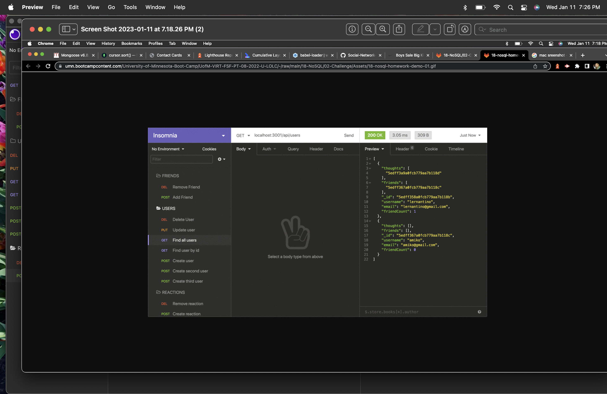

# Social-Network-API

## Description

As a social media startup I want an API for my social network that uses a NoSQL database so that my website can handle large amounts of unstructured data.
Given a social network API when I enter the command to invoke the application then my server is started and the Mongoose models are synced to the MongoDB database.
When I open API GET routes in Insomnia for users and thoughts then the data for each of these routes is displayed in a formatted JSON.
When I test API POST, PUT, and DELETE routes in Insomnia then I am able to successfully create, update, and delete users and thoughts in my database.
When I test API POST and DELETE routes in Insomnia then I am able to successfully create and delete reactions to thoughts and add and remove friends to a user’s friend list.

## Table of Contents (Optional)

- [Installation](#installation)
- [Usage](#usage)
- [Credits](#credits)
- [License](#license)

## Installation

Express, Mongoose and Insomnia were used in creating this API. 

## Usage

  Video Demonstration: https://drive.google.com/file/d/13UsLhSlxSjBrLFYx4-YMvAOEYokRmSTW/view  
  
    
   
 

## Credits

No other collaborators at this time.

## License

MIT License
